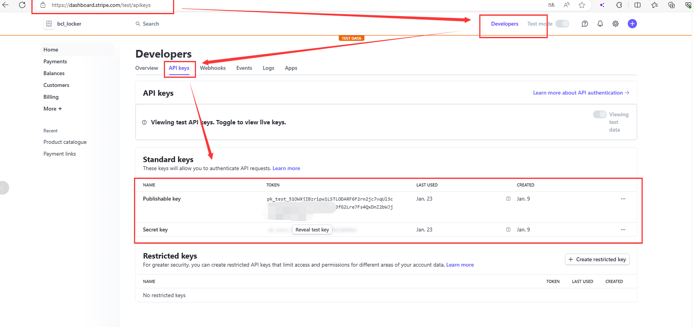
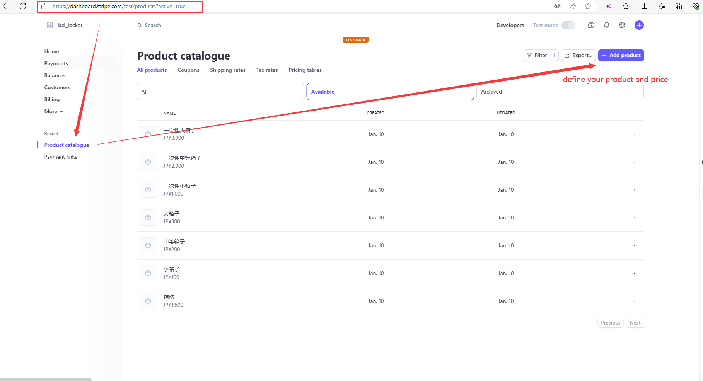
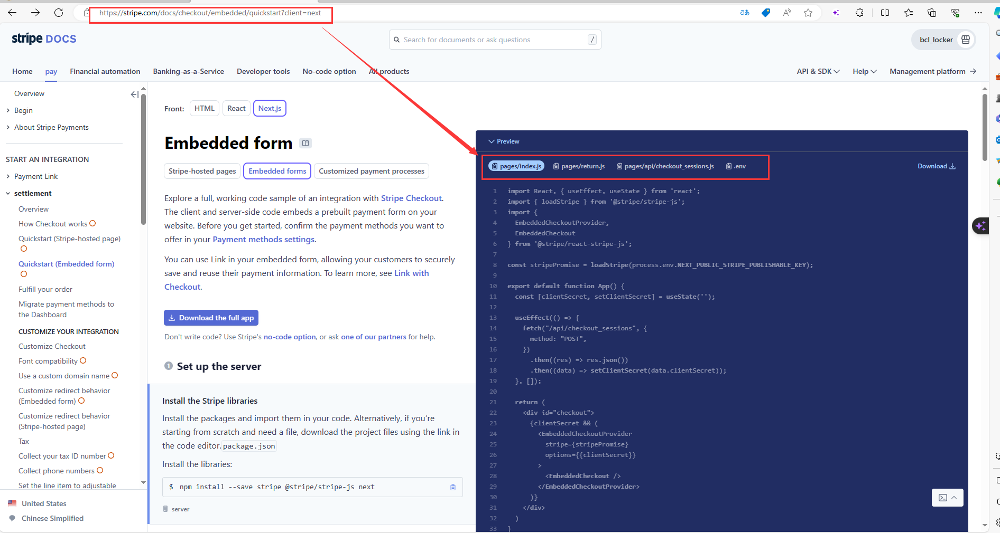
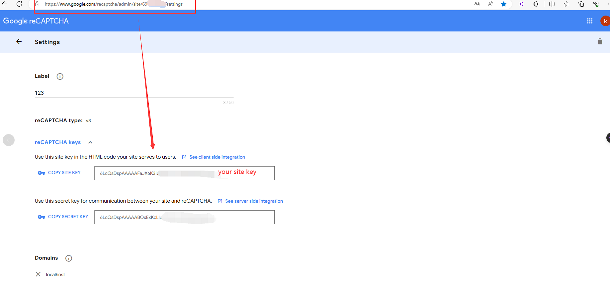

# 🔐 KEYVOX Locker Demo (Next.js)

これは、**KEYVOXロッカーシステム**の構築に使える [Next.js](https://nextjs.org/) ベースのテンプレートプロジェクトです。  
自社のコインロッカーサービスを素早く立ち上げたい方のための、**スタートキット**です。

***KEYVOX Smart Locker***
https://locker.keyvox.co

***APIドキュメント***
https://developers.keyvox.co

***KEVOX Locker API Key取得方法：***
https://keyvox.notion.site/API-44c489d8c97a4eba8a7fa0028c3b39a1?source=copy_link
    
> This is a [Next.js](https://nextjs.org/) based template project for building a **KEYVOX Locker System**.  
> Use this as a starter kit to quickly launch your own locker service.

---

## ✅ セットアップ手順 / Setup Instructions

### 1. 環境変数（`.env.development`）の準備  
### 1. Prepare `.env.development`

`.env.development` を開き、以下の値を設定してください。  
Open `.env.development` and set the following values:

#### 🔑 KEYVOX APIキーの取得 / Get KEYVOX API Keys

1. [https://eco.blockchainlock.io/bacs-web](https://eco.blockchainlock.io/bacs-web) にアクセス  
2. 右上のプロフィール → 「Developers」→「API」ページを開く  
3. `API_KEY` と `API_SECRET` を取得し `.env` に記載  
※KEYVOXのスマートロッカーの購入が必要です。

> 1. Visit [https://eco.blockchainlock.io/bacs-web](https://eco.blockchainlock.io/bacs-web)  
> 2. Click profile icon → "Developers" → "API" section  
> 3. Retrieve `API_KEY` and `API_SECRET`, and add them to `.env`  
> ※ You need a KEYVOX smart lock to access this feature.

---

### 2. データベースの設定 / Database Configuration

自分のMySQL環境に合わせて、以下を `.env` に記載：  
Set your MySQL credentials in `.env`:

```env
DB_HOST=
DB_USER=
DB_PWD=
DB_NAME=
DB_PORT=
```

### 3. Stripe（決済）の設定 / Stripe Payment Setup
Stripeのテストダッシュボードに登録：Stripe Dashboard

価格別に Product ID（例：price_xxxxxxx）を作成
    
    
    
    

取得したキーを .env に記載：

```env
STRIPE_PUBLIC_KEY=
STRIPE_SECRET_KEY=
```
See Stripe Embedded Checkout Quickstart for integration.

### 4. Google reCAPTCHA 設定 / reCAPTCHA Setup
Google reCAPTCHA v3 を使ってBot対策をします。
生成したキーを next.config.ts に設定してください。

Use reCAPTCHA v3 for bot protection on login. Add your keys to next.config.ts.

## 📦 依存関係のインストール / Install Dependencies
```
yarn install
# or
npm install
```

## ▶️ 開発サーバー起動 / Start Dev Server
```
yarn dev
# or
npm run dev
.env.development を読み込みます。
```
Uses .env.development

## 📦 本番ビルド / Build for Production
```
yarn build
# or
npm run build
```

## 🚀 本番モード起動 / Start Production Server
```
yarn start
# or
npm run start
.env.production を読み込みます。
```
Uses .env.production

## 📁 ディレクトリ構成 / Project Directory Structure
## 📁 ディレクトリ構成 / Project Directory Structure

| ディレクトリ / Directory      | 説明 / Description                          |
|------------------------------|--------------------------------------------|
| `.next/`                     | ビルド結果 / Build output                  |
| `node_modules/`              | パッケージ / Installed packages            |
| `public/`                    | 静的ファイル / Static assets               |
| `src/`                       | ソースコード / Source code                 |
| ├─ `assets/images/`          | 画像 / Images                              |
| ├─ `client/`                 | API呼び出し定義 / API client logic         |
| ├─ `components/`             | 再利用UI部品 / Reusable components         |
| ├─ `locales/`                | 多言語設定 / i18n translations             |
| ├─ `pages/`                  | ページとルーティング / Pages and routing   |
| ├─ `server/`                 | サーバー側処理 / Server-side APIs         |
| ├─ `types/`                  | 型定義 / Type definitions                  |
| └─ `utils/`                  | ユーティリティ関数 / Utility functions     |
| `next.config.js`             | Next.js 設定 / Next.js config              |
| `tsconfig.json`              | TypeScript 設定 / TypeScript config        |


## 🛠 技術スタック / Tech Stack
項目 / Feature	使用技術 / Technology
フロントエンド / Frontend	Next.js, React, TypeScript
バックエンド / Backend	Next.js API Routes (一部 Java)
データベース / Database	MySQL
決済 / Payment	Stripe
Bot対策 / Bot Protection	Google reCAPTCHA v3

## 📄 ライセンス / License
MIT License
