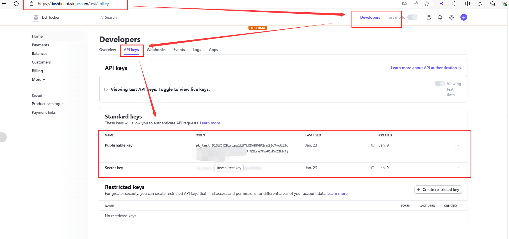
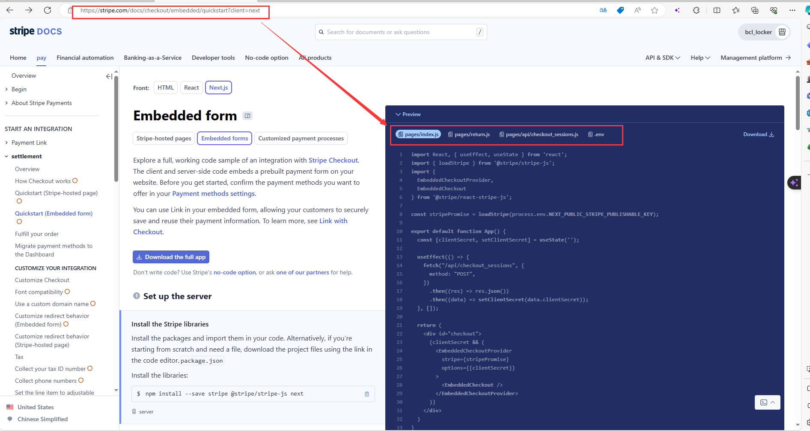

This is a [Next.js](https://nextjs.org/) project for KEYVOX locker. 
You can use this template as a basis for building your locker project. 
To get started, follow these steps:

## prepare work
1: Open the .env.development file and update several variables to your own. 
    The specific method for obtaining these variables is as follows.
    

  
2: To obtain these values, purchase a Keyvox lock, visit the [https://eco.blockchainlock.io/bacs-web] page,click on the profile icon in the upper right corner, then navigate to the "Developers" section, then go to the API page to retrieve the **API_KEY** and  **API_SECRET**. 
    Replace the obtained values with the corresponding variables in the environment file.
    

3:  Configure the database on your own by updating the following content:   **DB_HOST,DB_USER,DB_PWD,DB_NAME,DB_PORT**
 
4:  Define Prices for Different Box Sizes (Displayed on the Showcase Page for Customer Reference):

5:  Register an Account on Stripe [https://dashboard.stripe.com/test/dashboard] for Payment Collection. 
    Simultaneously, Define Prices for Different Box Sizes and Obtain Corresponding Product IDs. ID seems like **price_xxxxxxxxxxxxx**.
    Stripe Internally Calculates the Price Using the Product ID to Display the Amount Customers Should Pay (Used for Actual Payment).  
    Vist [https://stripe.com/docs/checkout/embedded/quickstart?client=next] get your own **stripe_public_key** and **stripe_secret_key**.
    
    
    

6:  In the [next.config.ts] file, the value for **googleKey**, defined, which is used for robot verification on the login page. 
    You can generate your own  Google Key by following the instructions at [https://developers.google.com/recaptcha/docs/v3].
    


## install dependencies
 ```bash
yarn insatll
or
npm  install
```

## getting start   (this version read your [.env.development] file)
```bash
yarn dev
or
npm run dev    
```

## project bundling
```bash
yarn build
or
npm run build
```

## run bundling version  (this version read your [.env.production] file)
```bash
yarn start
or
npm run start   
```


## Project Directory Structure

1. **[.next]:** This directory contains the built pages and other assets after the build process.

2. **[node_modules]:** Dependencies installed using **yarn install** are displayed here.

3. **[public]:** Static resources stored in this directory will be directly copied to the build output directory.

4. **[src]:** This directory is typically used to store the application's source code, including components, utility functions, etc.
    4.1 **[assets/images]:** This folder holds images used in the program.
    4.2 **[client]:** Defines the logic for API interfaces, such as input parameters and API response formats.
    4.3 **[components]:** This folder contains reusable components that can be imported and used by different pages.
    4.4 **[locales]:** Configuration for multilingual support, including translation files.
    4.5 **[pages]:** One of the most important directories in Next.js. Each file in this directory maps to a corresponding route.
    4.6 **[server]:** If APIs are called from the server backend instead of the client, definitions are placed here.
    4.7 **[types]:** This folder defines various types used for API response types.
    4.8 **[utils]:** Contains utility classes used throughout the program, such as login status verification.

5. **[next.config.js]:** Next.js configuration file for build and webpack configurations.

6. **[tsconfig.json]:** TypeScript configuration file.


## Project Tech Stack Overview

This project is built on the Next.js framework, predominantly utilizing React and TypeScript for frontend development.
The backend logic is largely handled through Next.js API routes, eliminating the need for a standalone backend language. 
A small portion of the backend logic is implemented using Java.

MySQL is employed as the database to store information related to user locker rentals. 

This program follows the MIT License.
